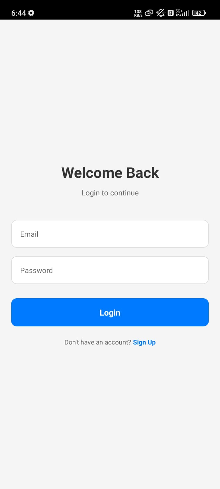
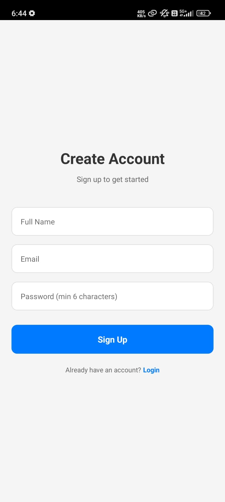
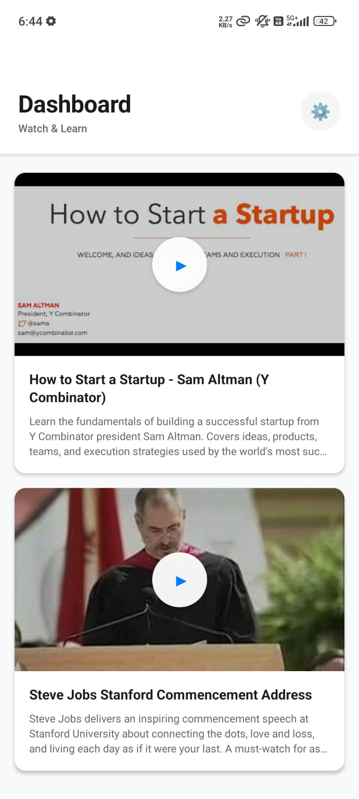
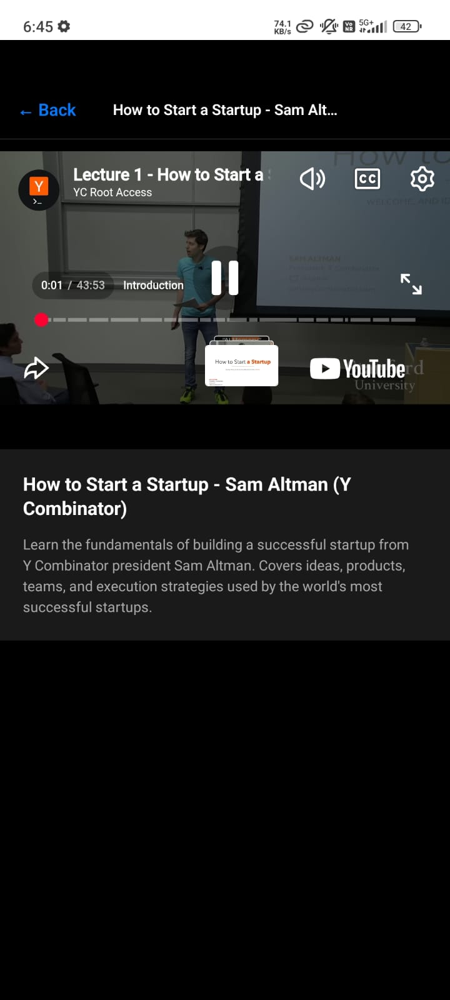
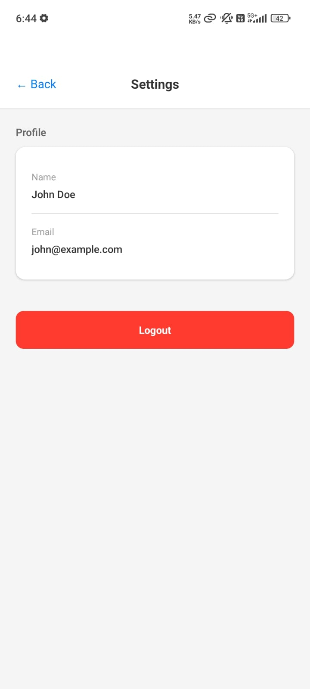

# 📱 Video Streaming App - Mobile Frontend

A beautiful, secure React Native mobile application for video streaming with JWT authentication and seamless YouTube video playback.

<div align="center">


</div>

---

## 📸 App Screenshots

<div align="center">

### 🔐 Authentication Flow

<table>
  <tr>
    <td align="center">
      
      <br/>
      <b>Login Screen</b>
      <br/>
      <sub>Secure authentication with email & password</sub>
    </td>
    <td align="center">
      
      <br/>
      <b>Signup Screen</b>
      <br/>
      <sub>New user registration with validation</sub>
    </td>
  </tr>
</table>

### 📺 Video Experience

<table>
  <tr>
    <td align="center">
      
      <br/>
      <b>Dashboard</b>
      <br/>
      <sub>Browse curated startup videos</sub>
    </td>
    <td align="center">
      
      <br/>
      <b>Video Player</b>
      <br/>
      <sub>Full-screen playback with controls</sub>
    </td>
    <td align="center">
      
      <br/>
      <b>Settings</b>
      <br/>
      <sub>User profile & account management</sub>
    </td>
  </tr>
</table>

</div>

---

## 🎯 Key Features

<table>
<tr>
<td width="50%">

### 🔐 Authentication
- ✅ JWT-based secure authentication
- ✅ Persistent login across sessions
- ✅ Automatic token management
- ✅ Secure logout with token clearing

### 📺 Video Streaming
- ✅ YouTube video integration
- ✅ Full playback controls
- ✅ Smooth video transitions
- ✅ Error handling & retry logic

</td>
<td width="50%">

### 🎨 User Experience
- ✅ Modern, intuitive UI design
- ✅ Smooth navigation animations
- ✅ Pull-to-refresh functionality
- ✅ Loading states & error messages

### ⚡ Performance
- ✅ Optimized API calls
- ✅ Efficient state management
- ✅ Fast load times
- ✅ Responsive on all devices

</td>
</tr>
</table>

---

## 🛠️ Tech Stack

| Technology | Version | Purpose |
|:-----------|:--------|:--------|
| **React Native** | 0.81.5 | Cross-platform mobile framework |
| **Expo** | ~54.0 | Development & build platform |
| **React Navigation** | 7.x | Screen navigation & routing |
| **Axios** | 1.13.4 | HTTP client for API calls |
| **AsyncStorage** | 2.2.0 | Local data persistence |
| **react-native-youtube-iframe** | 2.x | YouTube video playback |

---

## 🚀 Quick Start

### Prerequisites

- Node.js 16+
- Expo Go app ([iOS](https://apps.apple.com/app/expo-go/id982107779) | [Android](https://play.google.com/store/apps/details?id=host.exp.exponent))
- Backend API running

### Installation & Configuration

```bash
# Clone and install
git clone <your-repo-url>
cd frontend-repo
npm install

# Configure API endpoint
# Edit src/services/api.js with your backend IP
const API_BASE_URL = 'http://YOUR_IP:5000';

# Start development server
npm start
```

---

## 📱 Architecture

### Component Hierarchy

```
App.js (Root)
├── NavigationContainer
│   ├── AuthStack (Unauthenticated)
│   │   ├── LoginScreen
│   │   └── SignupScreen
│   │
│   └── MainStack (Authenticated)
│       ├── DashboardScreen
│       │   └── VideoTile × 2
│       ├── VideoPlayerScreen
│       │   └── YoutubePlayer
│       └── SettingsScreen
```

### Authentication Flow

```
App Launch → Check Token → [Found? MainStack : AuthStack]
                                      ↓
                              Login → Save Token → MainStack
```

### Data Flow

```
User Action → Component → API Service → Axios (adds JWT) → Backend
                                                              ↓
UI Update ← Component ← API Service ← Axios ← Response
```

---

## 🎨 Design System

### Color Palette

| Color | Hex | Usage |
|:------|:----|:------|
| **Primary Blue** | `#007AFF` | Buttons, links, accents |
| **Background** | `#f8f9fa` | App background |
| **Card** | `#ffffff` | Card background |
| **Text Primary** | `#1a1a1a` | Main text |
| **Text Secondary** | `#666666` | Secondary text |
| **Player BG** | `#000000` | Video player |
| **Error** | `#FF3B30` | Error states |

### Typography

| Element | Size | Weight |
|:--------|:-----|:-------|
| Large Title | 32px | Bold (700) |
| Title | 20px | Bold (700) |
| Headline | 18px | Semibold (600) |
| Body | 16px | Regular (400) |
| Caption | 14px | Medium (500) |

---

## 📁 Project Structure

```
frontend-repo/
│
├── src/
│   ├── components/
│   │   └── VideoTile.js
│   │
│   ├── screens/
│   │   ├── LoginScreen.js
│   │   ├── SignupScreen.js
│   │   ├── DashboardScreen.js
│   │   ├── VideoPlayerScreen.js
│   │   └── SettingsScreen.js
│   │
│   ├── services/
│   │   ├── api.js
│   │   └── auth.js
│   │
│   └── utils/
│       └── storage.js
│
├── screenshots/
├── App.js
├── package.json
└── README.md
```

---

## 🔌 API Integration

### Axios Configuration

```javascript
// Automatic JWT injection
api.interceptors.request.use(async (config) => {
  const token = await AsyncStorage.getItem('authToken');
  if (token) config.headers.Authorization = `Bearer ${token}`;
  return config;
});

// Automatic logout on 401
api.interceptors.response.use(
  (response) => response,
  async (error) => {
    if (error.response?.status === 401) {
      await AsyncStorage.removeItem('authToken');
    }
    return Promise.reject(error);
  }
);
```

### Endpoints

| Method | Endpoint | Purpose |
|:-------|:---------|:--------|
| POST | `/auth/signup` | Create account |
| POST | `/auth/login` | Authenticate |
| GET | `/auth/me` | Get profile |
| POST | `/auth/logout` | End session |
| GET | `/dashboard` | Get videos |
| GET | `/video/:id/stream` | Get stream URL |

---

## 👤 User Journey

```
1. First Launch
   └─ No Token → Login Screen

2. Signup
   └─ Enter Details → POST /auth/signup → Success → Login Screen

3. Login
   └─ Credentials → POST /auth/login → JWT → AsyncStorage → Dashboard

4. Browse Videos
   └─ GET /dashboard → Display 2 Videos → Pull-to-refresh

5. Watch Video
   └─ Tap Video → GET /video/:id/stream → YouTube Player

6. Settings
   └─ View Profile → Logout → Clear Token → Login Screen
```

---

## 🐛 Troubleshooting

### Network Error

**Problem:** Can't connect to backend

**Fix:**
1. Backend running? Check `http://localhost:5000`
2. Correct IP in `api.js`? Use computer's IP, not localhost
3. Same WiFi network?
4. Test from phone browser: `http://YOUR_IP:5000`

### Video Won't Play

**Problem:** Error 153 or video fails

**Fix:**
1. Using `react-native-youtube-iframe`? (Not webview)
2. Android: Set `androidLayerType: 'hardware'`
3. Playback token valid?

---

## 🚀 Production Build

```bash
# Install EAS CLI
npm install -g eas-cli

# Android APK
eas build --platform android --profile preview

# iOS (requires Apple Developer account)
eas build --platform ios --profile production
```

---

## ✅ Assignment Compliance

✅ React Native mobile app  
✅ Thin client (zero business logic)  
✅ JWT authentication  
✅ Signup & Login screens  
✅ Dashboard with 2 videos  
✅ Video player with controls  
✅ Settings screen  
✅ Professional UI/UX  
✅ Error handling  
✅ Clean code structure  

---

## 👤 Author

**Monish S**  
📧 monishravi508@gmail.com  
🔗 [GitHub](https://github.com/Swordship)  
💼 [LinkedIn](https://www.linkedin.com/in/monish-s-a37482274/)  

---

## 📄 License

Educational project demonstrating full-stack mobile development.

---

<div align="center">

**Built with ❤️ using React Native & Expo**

</div>