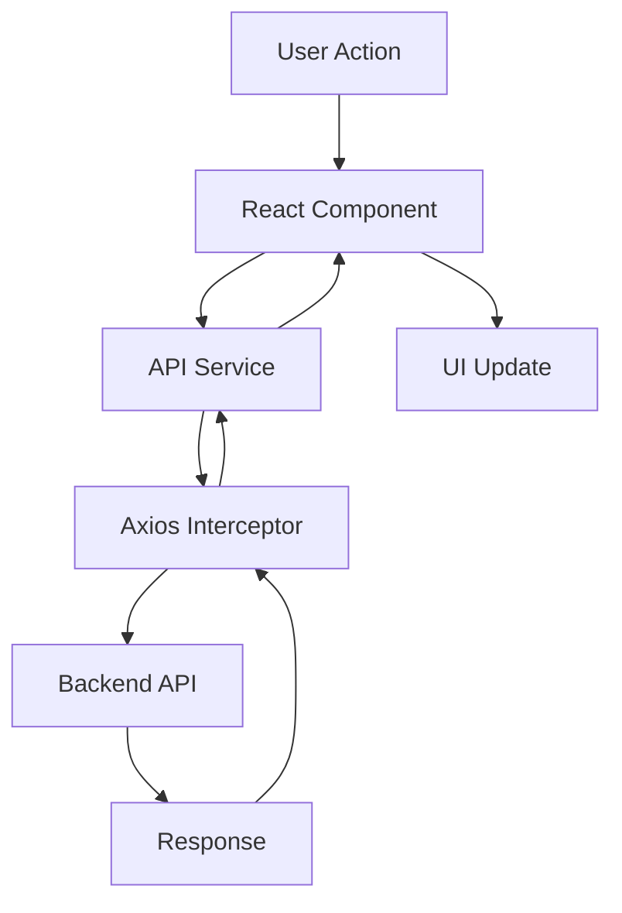

# 📱 Video Streaming App - Mobile Frontend

A beautiful, secure React Native mobile application for video streaming with JWT authentication and seamless YouTube video playback.

<div align="center">


</div>

---

## 📸 App Screenshots

<div align="center">

### 🔐 Authentication Flow

<table>
  <tr>
    <td align="center">
      
      <br/>
      <b>Login Screen</b>
      <br/>
      <sub>Secure authentication with email & password</sub>
    </td>
    <td align="center">
      
      <br/>
      <b>Signup Screen</b>
      <br/>
      <sub>New user registration with validation</sub>
    </td>
  </tr>
</table>

### 📺 Video Experience

<table>
  <tr>
    <td align="center">
      
      <br/>
      <b>Dashboard</b>
      <br/>
      <sub>Browse curated startup videos</sub>
    </td>
    <td align="center">
      
      <br/>
      <b>Video Player</b>
      <br/>
      <sub>Full-screen playback with controls</sub>
    </td>
    <td align="center">
      
      <br/>
      <b>Settings</b>
      <br/>
      <sub>User profile & account management</sub>
    </td>
  </tr>
</table>

</div>

---

## 🎯 Key Features

<table>
<tr>
<td width="50%">

### 🔐 Authentication
- ✅ JWT-based secure authentication
- ✅ Persistent login across sessions
- ✅ Automatic token refresh
- ✅ Secure logout with token clearing

### 📺 Video Streaming
- ✅ YouTube video integration
- ✅ Full playback controls
- ✅ Smooth video transitions
- ✅ Error handling & retry logic

</td>
<td width="50%">

### 🎨 User Experience
- ✅ Modern, intuitive UI design
- ✅ Smooth navigation animations
- ✅ Pull-to-refresh functionality
- ✅ Loading states & error messages

### ⚡ Performance
- ✅ Optimized API calls
- ✅ Efficient state management
- ✅ Fast load times
- ✅ Responsive on all devices

</td>
</tr>
</table>

---

## 🛠️ Tech Stack

| Technology | Version | Purpose |
|:-----------|:--------|:--------|
| **React Native** | 0.81.5 | Cross-platform mobile framework |
| **Expo** | ~54.0 | Development & build platform |
| **React Navigation** | 7.x | Screen navigation & routing |
| **Axios** | 1.13.4 | HTTP client for API calls |
| **AsyncStorage** | 2.2.0 | Local data persistence |
| **react-native-youtube-iframe** | 2.x | YouTube video playback |

---

## 🚀 Quick Start

### Prerequisites

- Node.js 16+ installed
- Expo Go app on your phone ([iOS](https://apps.apple.com/app/expo-go/id982107779) | [Android](https://play.google.com/store/apps/details?id=host.exp.exponent))
- Backend API running (see backend README)

### Installation

```bash
# Clone the repository
git clone <your-repo-url>
cd frontend-repo

# Install dependencies
npm install

# Start the development server
npm start
```

### Configuration

**Important:** Update the API base URL with your computer's IP address.

1. Find your computer's IP:
   ```bash
   # Windows
   ipconfig
   
   # Mac/Linux
   ifconfig | grep "inet "
   ```

2. Update `src/services/api.js`:
   ```javascript
   const API_BASE_URL = 'http://YOUR_COMPUTER_IP:5000';
   // Example: 'http://192.168.1.100:5000'
   ```

3. Restart Expo and reload the app

---

## 📱 App Architecture

### Component Hierarchy

```
App.js (Root)
├── NavigationContainer
│   ├── AuthStack (Unauthenticated)
│   │   ├── LoginScreen
│   │   └── SignupScreen
│   │
│   └── MainStack (Authenticated)
│       ├── DashboardScreen
│       │   └── VideoTile × 2
│       ├── VideoPlayerScreen
│       │   └── YoutubePlayer
│       └── SettingsScreen
```

### Data Flow



### Authentication Flow

```
App Launch
    ↓
Check AsyncStorage for Token
    ↓
├─ Token Found → Show MainStack (Dashboard)
│
└─ No Token → Show AuthStack (Login/Signup)
         ↓
    User Logs In
         ↓
    Save Token to AsyncStorage
         ↓
    Navigate to MainStack
```

---

## 🎨 Design System

### Color Palette

```javascript
// Primary Colors
PRIMARY_BLUE    = '#007AFF'  // Buttons, links, accents
BACKGROUND      = '#f8f9fa'  // App background
CARD_BG         = '#ffffff'  // Card background

// Text Colors
TEXT_PRIMARY    = '#1a1a1a'  // Main text
TEXT_SECONDARY  = '#666666'  // Secondary text
TEXT_TERTIARY   = '#999999'  // Tertiary text

// Special
PLAYER_BG       = '#000000'  // Video player background
ERROR           = '#FF3B30'  // Error states
SUCCESS         = '#34C759'  // Success states
```

### Typography

| Element | Size | Weight | Usage |
|:--------|:-----|:-------|:------|
| **Large Title** | 32px | Bold (700) | Screen headers |
| **Title** | 20px | Bold (700) | Section headers |
| **Headline** | 18px | Semibold (600) | Video titles |
| **Body** | 16px | Regular (400) | Body text |
| **Caption** | 14px | Medium (500) | Secondary info |
| **Small** | 12px | Regular (400) | Labels |

### Spacing System

```javascript
SPACING = {
  xs: 4,
  sm: 8,
  md: 12,
  lg: 16,
  xl: 20,
  xxl: 24,
}
```

---

## 📁 Project Structure

```
frontend-repo/
│
├── src/
│   ├── components/          # Reusable components
│   │   └── VideoTile.js     # Video card component
│   │
│   ├── screens/             # Screen components
│   │   ├── LoginScreen.js
│   │   ├── SignupScreen.js
│   │   ├── DashboardScreen.js
│   │   ├── VideoPlayerScreen.js
│   │   └── SettingsScreen.js
│   │
│   ├── services/            # API & business logic
│   │   ├── api.js           # Axios configuration
│   │   └── auth.js          # Authentication functions
│   │
│   └── utils/               # Utility functions
│       └── storage.js       # AsyncStorage helpers
│
├── screenshots/             # App screenshots
│   ├── 01-login.png
│   ├── 02-signup.png
│   ├── 03-dashboard.png
│   ├── 04-video-player.png
│   └── 05-settings.png
│
├── App.js                   # Root component
├── package.json             # Dependencies
└── README.md                # This file
```

---

## 🔌 API Integration

### Axios Configuration

The app uses Axios with interceptors for automatic token management:

```javascript
// Request Interceptor (adds JWT to headers)
api.interceptors.request.use(async (config) => {
  const token = await AsyncStorage.getItem('authToken');
  if (token) {
    config.headers.Authorization = `Bearer ${token}`;
  }
  return config;
});

// Response Interceptor (handles 401 errors)
api.interceptors.response.use(
  (response) => response,
  async (error) => {
    if (error.response?.status === 401) {
      await AsyncStorage.removeItem('authToken');
      // User automatically redirected to login
    }
    return Promise.reject(error);
  }
);
```

### API Endpoints Used

| Method | Endpoint | Purpose |
|:-------|:---------|:--------|
| POST | `/auth/signup` | Create new account |
| POST | `/auth/login` | Authenticate user |
| GET | `/auth/me` | Get user profile |
| POST | `/auth/logout` | End session |
| GET | `/dashboard` | Get video list |
| GET | `/video/:id/stream` | Get video stream URL |

---

## 👤 User Flows

### Complete User Journey

#### 1️⃣ First Launch & Signup

```
Open App → No Token Found → Login Screen
                                  ↓
                         Tap "Sign Up"
                                  ↓
                         Signup Screen
                                  ↓
              Enter: Name, Email, Password
                                  ↓
                      POST /auth/signup
                                  ↓
                    Success Message
                                  ↓
                  Return to Login Screen
```

#### 2️⃣ Login & Browse Videos

```
Login Screen → Enter Credentials → POST /auth/login
                                          ↓
                                    Receive JWT
                                          ↓
                              Save to AsyncStorage
                                          ↓
                                   Dashboard
                                          ↓
                            GET /dashboard (with JWT)
                                          ↓
                          Show 2 Video Tiles
```

#### 3️⃣ Watch Video

```
Tap Video Tile → VideoPlayerScreen
                        ↓
        GET /video/:id/stream?token=...
                        ↓
           Receive YouTube Embed URL
                        ↓
              Extract Video ID
                        ↓
            Pass to YoutubePlayer
                        ↓
               Video Plays
```

#### 4️⃣ Settings & Logout

```
Tap Settings Icon → SettingsScreen
                          ↓
               Show User Profile
                          ↓
                   Tap Logout
                          ↓
             Confirmation Dialog
                          ↓
           POST /auth/logout
                          ↓
        Clear AsyncStorage
                          ↓
          Show Login Screen
```

---

## 🐛 Troubleshooting

### Network Errors

**Problem:** "Network Error" when trying to login

**Solution:**
1. Check backend is running
2. Verify API URL in `src/services/api.js` uses your computer's IP
3. Ensure phone and computer are on same WiFi
4. Test backend from phone's browser: `http://YOUR_IP:5000`

### Video Playback Issues

**Problem:** Videos won't play or show "Error 153"

**Solution:**
1. Verify using `react-native-youtube-iframe` (not react-native-webview)
2. Check Android layer type is set to 'hardware'
3. Ensure playback token is valid

### App Won't Load

**Problem:** App shows loading screen forever

**Solution:**
1. Clear Expo cache: `npm start -- --clear`
2. Delete `node_modules` and reinstall: `rm -rf node_modules && npm install`
3. Check for syntax errors in terminal logs

---

## 📸 How to Add Your Screenshots

### Step 1: Take Screenshots

On your phone:
- **Login Screen** - Before entering data
- **Signup Screen** - Before entering data
- **Dashboard** - Showing both videos
- **Video Player** - While video is playing
- **Settings** - Showing your profile

### Step 2: Transfer to Computer

- **iPhone:** AirDrop, iCloud Photos, or email
- **Android:** USB cable or Google Photos

### Step 3: Organize Files

```bash
# Create screenshots folder
mkdir screenshots

# Rename files clearly
01-login.png
02-signup.png
03-dashboard.png
04-video-player.png
05-settings.png

# Place in screenshots/ folder
```

### Step 4: Commit to Git

```bash
git add screenshots/
git add README.md
git commit -m "docs: Add app screenshots"
git push
```

**Screenshots will automatically display in your README on GitHub!**

---

## 🎯 Testing Checklist

Before submission, verify:

- [ ] App installs and runs without errors
- [ ] Signup creates new account successfully
- [ ] Login authenticates and navigates to dashboard
- [ ] Dashboard shows 2 videos with thumbnails
- [ ] Tapping video opens player and plays video
- [ ] Video controls work (play, pause, seek)
- [ ] Settings shows correct user information
- [ ] Logout clears token and returns to login
- [ ] Pull-to-refresh updates dashboard
- [ ] Network errors show user-friendly messages
- [ ] App works on physical device via Expo Go

---

## 🚀 Building for Production

### Android APK

```bash
# Install EAS CLI
npm install -g eas-cli

# Login
eas login

# Build APK
eas build --platform android --profile preview
```

### iOS IPA

```bash
# Requires Apple Developer account
eas build --platform ios --profile production
```

---

## 📚 Documentation Links

- [React Native Docs](https://reactnative.dev/docs/getting-started)
- [Expo Documentation](https://docs.expo.dev/)
- [React Navigation](https://reactnavigation.org/docs/getting-started)
- [Axios Documentation](https://axios-http.com/docs/intro)
- [YouTube iFrame API](https://developers.google.com/youtube/iframe_api_reference)

---

## 🤝 Assignment Requirements

This frontend meets all assignment criteria:

✅ React Native mobile application  
✅ Thin client architecture (zero business logic)  
✅ JWT authentication with secure storage  
✅ Signup & Login screens with validation  
✅ Dashboard showing 2 videos from backend  
✅ Video player with YouTube integration  
✅ Settings screen with user profile  
✅ Logout functionality  
✅ Professional UI/UX design  
✅ Proper navigation flow  
✅ Error handling & loading states  
✅ Clean, maintainable code structure  

---

## 👤 Author

**Monish**  
📧 Email: monishravi508@gmail.com
🔗 GitHub: [@Swordship](https://github.com/Swordship)  
💼 LinkedIn: [Monish S](https://www.linkedin.com/in/monish-s-a37482274/)  

---

## 📄 License

This project was created as part of a technical assignment to demonstrate full-stack mobile development capabilities.

---

<div align="center">

### ⭐ Star this repo if you found it helpful!

**Built with ❤️ using React Native & Expo**

</div>